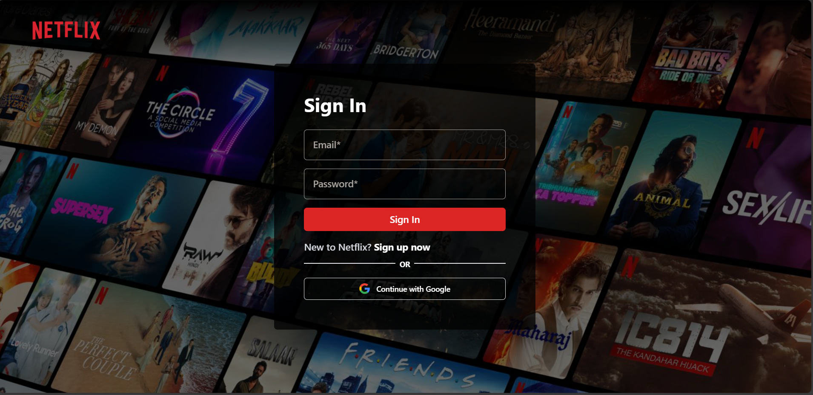
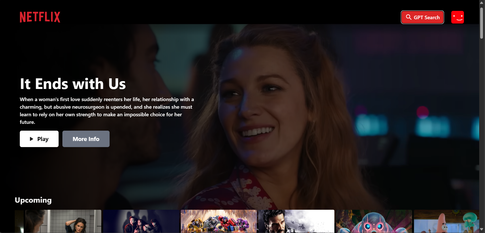
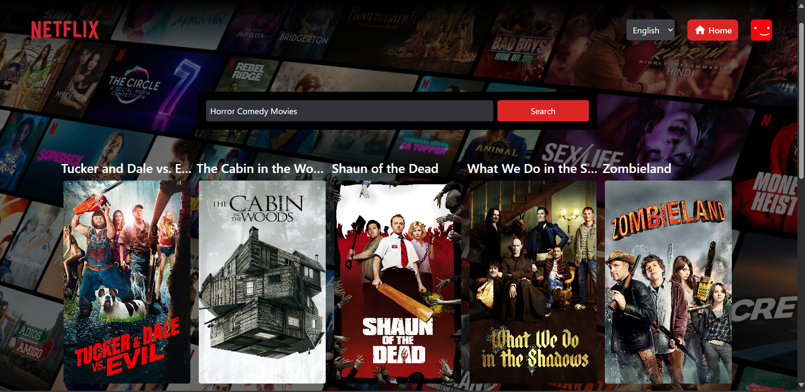

# 🎬 Netflix GPT

  
  
  
  
  
  
  
  

Netflix GPT is a modern **Netflix clone** that allows users to browse movies, authenticate securely, and get **personalized AI-powered movie recommendations**.  
Built with **React, Firebase, TMDB API, and Open AI**.  

---

## ✨ Features
- 🔑 **Firebase Authentication** – Secure login/signup with Firebase.  
- 🎥 **TMDB Integration** – Fetch and display movies from The Movie Database.  
- 🤖 **Gemini AI Movie Recommendations** – Enter prompts (e.g., "funny comedies", "thriller for weekend") to get AI-powered suggestions.  
- 🖥️ **Netflix-like UI** – Familiar, clean, and responsive browsing experience.  
- ☁️ **Future Cloud Messaging** – Push notifications & in-app messaging coming soon.  
- 🌙 **Dark Mode Friendly** – Modern Netflix-inspired design.  

---

## 📸 Preview

  
  
  

---

## 🌍 Live Demo
Check out the live demo here: 👉 [Netflix GPT](https://netflix-gpt-eight-tawny.vercel.app)  

---

## 🛠️ Tech Stack

### 🔹 Frontend:
- React.js  
- Redux Toolkit (State Management)  
- React Router DOM (Routing)  
- Tailwind CSS (Styling)  

### 🔹 Backend:
- Firebase Authentication (User Auth)  
- Firebase Firestore (Database - future enhancements)  
- Firebase Hosting (App Deployment)  

### 🔹 APIs:
- TMDB API (Movie Data)  
- OpenAI API (AI Recommendations)  

### 🔹 Tools:
- Git & GitHub (Version Control)  
- Vercel (Deployment)  

---

## ⚡ Usage
1. **Sign in** with Firebase authentication to unlock personalized features.  
2. **Browse movies** and explore details using TMDB API.  
3. **Enter prompts** to get AI-powered personalized recommendations from OpenAI.  

---

## 🛠️ Installation & Setup

Follow these steps to run **Netflix GPT** locally:

1. **Clone the repository:**
   ```bash
   git clone https://github.com/krishh21/netflix-gpt.git
   cd netflix-gpt
Install dependencies:
 ```bash
npm install
 ```

Create a .env file in the root directory and add the following:

REACT_APP_TMDB_API_KEY=your_tmdb_api_key
REACT_APP_FIREBASE_API_KEY=your_firebase_api_key
REACT_APP_FIREBASE_AUTH_DOMAIN=your_firebase_auth_domain
REACT_APP_FIREBASE_PROJECT_ID=your_firebase_project_id
REACT_APP_FIREBASE_STORAGE_BUCKET=your_firebase_storage_bucket
REACT_APP_FIREBASE_MESSAGING_SENDER_ID=your_firebase_sender_id
REACT_APP_FIREBASE_APP_ID=your_firebase_app_id
REACT_APP_OPEN_API_KEY=your_open_api_key


Start the development server:
 ```bash
npm start
 ```

Visit http://localhost:3000
 🚀

📌 Roadmap / Upcoming Features

📱 Firebase Cloud Messaging for push notifications.

📝 User watchlist & favorites.

🎞️ Movie trailers & previews.

🌍 Multi-language support.

🤝 Contributing

Contributions, issues, and feature requests are welcome!
Feel free to fork this repo and create a pull request.

📜 License

This project is MIT licensed.

👨‍💻 Author

Developed by Krishna Yadav 🚀
Frontend Developer | MERN | React Native | Firebase | AI Integrations
